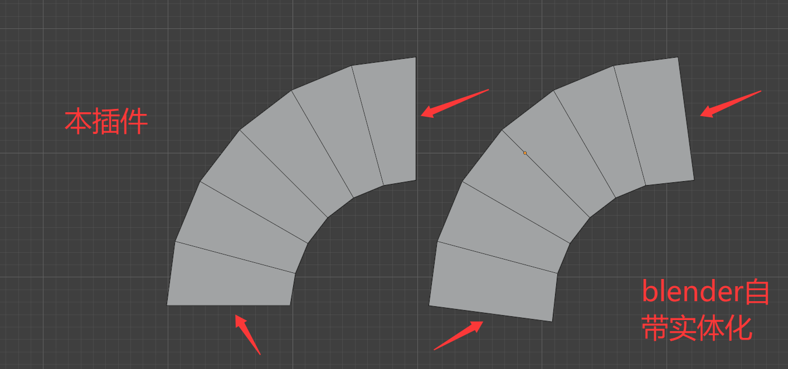

# Axisify

**实体化后把侧壁精确对齐到 X / Y / Z 轴。**

给物体加 Solidify（实体化）后，侧壁往往是斜的 —— 因为 Solidify 让侧壁沿着**顶点法线**生成，而法线在弯曲处是斜的。Axisify 把每条侧壁**投影到离它最近的坐标轴**上，让侧壁和所选轴严格平行。

```
原始（法线方向，斜）              对齐后（严格沿轴）
      Pt                              Pt
      │  ╲                            │
      │   ╲                           │
      │    Pb                         │  Pb'
      │                               │
   方向 ≈ 8.2°（斜）              方向 = 0.00°（平行）
```

## 效果对比



左右是同一个网格、同一个厚度：左边是 Axisify 的结果，右边是 Blender 自带的 Solidify 修改器。

差别的原因：Solidify 让侧壁沿着**顶点法线**生成，而法线在弯曲处是斜的，布线就被带歪了；
Axisify 把侧壁**投影到离它最近的坐标轴**上，所以侧壁规则、内外边界保持平行。

红箭头指的是差异最明显的位置。

## 下载

**直接下载插件压缩包**（该链接始终打包 `main` 分支的最新提交）：

https://github.com/1506594736/Axisify/archive/main.zip

## 安装

1. 下载上面的插件压缩包
2. 打开 Blender
3. 编辑 → 偏好设置 → 插件
4. 右上角下拉菜单选择「从磁盘安装」
5. 选中刚下载的 zip 文件
6. 勾选列表中的「**Axisify**」启用插件

> 安装后的插件目录名为 `Axisify-main`（压缩包的顶层目录名），属正常现象。

### 从旧版升级

1. 重新下载上面的 zip
2. 再次用「从磁盘安装」覆盖安装
3. **重启 Blender**（或在偏好设置里取消勾选再重新勾选插件）

> Blender 不会重新注册已注册的 Panel / Operator。覆盖文件后不重启，侧边栏还是旧界面，
> 但用户偏好设置里的版本号已经更新了 —— 这是最容易误判的坑。

### 手动安装（备选）

把整个文件夹丢进 `%APPDATA%\Blender Foundation\Blender\<版本>\scripts\addons\`，
重启 Blender 后在偏好设置里勾选启用。

## 使用

选中物体 → 3D 视图按 `N` → 切到 **Axisify** 标签页 → 设好参数 → 点按钮。

插件有两种用法：

### 方式一：作为修改器（推荐）

点「**作为修改器（可实时调整）**」。

它给物体加一个 **Geometry Nodes 修改器**（名字叫 `Axisify`），这个修改器**同时完成实体化和侧壁贴轴**：

- 出现在 Blender 的**修改器面板**里
- 参数直接在上面调，**实时生效**
- **不生成任何新物体**，场景里只有一个

修改器上的参数：

| 参数 | 默认 | 说明 |
|---|---|---|
| **厚度** | 0.01 | 实体化厚度 |
| **对齐到轴** | 开 | 关掉就是普通的等距实体化，方便对比 |
| **吸轴角度** | 10° | 法线与轴的夹角超过该值就不吸附到轴 |
| **固定轴 (0=自动)** | `(0,0,0)` | 填 `(0,0,1)` 强制所有侧壁对齐到 +Z；填 0 向量 = 每条侧壁各自选最近的轴 |
| **厚度钳制** | 0.9 | 防止厚度超过局部曲率半径时内层翻转自交；`0` = 关闭。详见下方「已知限制」 |
| **最大厚度 (0=不限)** | 0 | **硬上限**：不管自动钳制算出什么，实际厚度都不会超过它。细网格上最可靠的一招 |
| **合并顶点** | 0 | 把塌缩到一起的顶点焊成一个点，焊接距离 = `厚度 × 该值`。**一般用不到**，见下方 §3 |

> **这个修改器是从原始面片生成实体的**，所以要加在**还没实体化的曲面**上。
> 勾选「移除旧的实体化修改器」（默认开）会自动删掉物体上已有的 Solidify，避免出现两个模型。

### 方式二：烘焙成新物体

点「**对齐侧壁到轴（烘焙成新物体）**」。

结果是一个**独立的静态网格**（原名 + `_对齐`），原物体不动。适合要导出、或要继续手动改布线的情况。

- 「烘焙后移除实体化修改器」（默认开）会删掉插件刚加的 Solidify，避免场景里出现两个看起来一样的模型
- 想保留 Solidify 就取消勾选

> 如果物体上已经有 Axisify 修改器，烘焙时会跳过叠加 Solidify（否则会变成「实体化的实体化」）。

## 参数

下面的参数在**两种方式里都会用到**；「作为修改器」时它们会变成新修改器的初始值，之后在修改器面板里改。

### 实体化

| 参数 | 默认 | 对应 Solidify | 说明 |
|---|---|---|---|
| **自动设置实体化** | 开 | — | 勾上：点按钮时自动添加 / 更新 Solidify 修改器。<br>新建的会被移到修改器栈**顶部**。取消勾选则沿用物体自己的修改器 |
| **厚度** | 0.01 | Thickness | 实体化厚度。侧壁对齐后**墙长就等于它** |
| **方向** | 向内 | Offset | 向内（原件在外）= `-1`；居中 = `0`；向外（原件在内）= `+1` |
| **均匀厚度** | 关 | Even Thickness | 让垂直厚度处处相等。会改变转角处的布线 |
| **厚度钳制** | 0.9 | — | 防止厚度超过局部曲率半径时自交；`0` = 关闭。开关时烘焙会自动改走 Geometry Nodes 路径 |
| **最大厚度** | 0 | — | 硬上限，细网格上最可靠 |
| **合并顶点** | 0 | — | 焊接距离 = `厚度 × 该值`；一般用不到，见 §3 |

### 侧壁贴轴

| 参数 | 默认 | 说明 |
|---|---|---|
| **取轴方式** | 自动（就近轴） | 自动：每条侧壁各自选最贴近它原始方向的轴（横杆 + 竖柱这类模型用这个）<br>固定：所有侧壁统一投影到指定的轴 |
| **固定轴** | +Z | 仅「固定轴」模式下生效，可选 ±X / ±Y / ±Z |
| **吸轴容差** | 10° | 侧壁原始方向与轴的夹角超过该值就**保持原样不搬**。<br>默认 10° 只搬「本来就接近轴」的墙；想让**全部**侧壁都强制对齐就调大（最大 90°） |
| **最小轴向位移** | 0.05 | 投影后的轴向位移小于 `原厚度 × 该比例` 就跳过。防止把过薄的墙搬成零面积 |
| **盖/侧壁分界角** | 45° | 二面角小于该值的相邻面算同一片，用来把「盖面」和「侧壁」分开 |
| **自交保护** | 关 | 跳过自交 / 重叠区域内的侧壁。**实测开启后残留偏差反而更大（最大 8.2°），建议保持关闭** |

## 原理

```
Pb' = Pt + ((Pb - Pt) · Â) Â
```

- `Pt`：侧壁与外层盖面相连的那个顶点
- `Pb`：侧壁与内层盖面相连的那个顶点（会被搬到 `Pb'`）
- `Â`：这条墙选中的轴

也就是**把侧壁方向投影到轴上**，同时保持它在外层盖面上的落点不变。

算法流程：

1. 按二面角洪泛，把面分成「外层盖」「内层盖」「侧壁」三组
2. 找出两个相邻面都在侧壁组里的边 → 每条边就是一条「墙」
3. 对每条墙算方向，选最近的轴，投影
4. 输出新物体

## 已知限制

### 1. 内层边长会按比例收缩

**侧壁对齐后，弯曲处的内层边长会按 $(R-h)/R$ 收缩。**

这是等距偏移的几何结果，不是缺陷。以一根转角半径 $R \approx 0.28$、厚度 $h = 0.1$ 的料为例：

| 位置 | 外层边长 | 内层边长 | 比值 |
|---|---|---|---|
| 直段 | 3.80000 | 3.80000 | 1.0000 |
| 转角 | 0.07842 | 0.05024 | 0.6407 |

$(0.2795 - 0.1) / 0.2795 = 0.6422$ —— 数值精确吻合。直段半径无穷大，所以比值是 1。

**数学上可以证明**：「内层边与外层边等长（侧壁是矩形）」和「厚度处处 = $h$」是**互斥**的。
设内层弧是外层弧的平移副本（半径相同、弧长相同），要它处处距外层 $h$：

$$\bigl|\vec v + R\hat u\bigr| - R = h \quad \forall \hat u \;\Longrightarrow\; \vec v = 0$$

即两弧重合，矛盾。所以只能二选一：要么接受内层弧按比例收缩（本插件），要么接受厚度在弯曲处变薄甚至到 0。

### 2. 厚度超过曲率半径会翻转自交

等距偏移有个硬条件：**厚度必须小于局部的曲率半径 $R$**。

| 厚度 | 结果 |
|---|---|
| $h < R$ | 内层是正常的同心弧 |
| $h \to R$ | 内层塌缩成一个点 |
| $h > R$ | 内层穿过圆心翻到另一边，几何自交（看到一团翻折的扇面） |

「**厚度钳制**」就是防这个的。插件会给每个顶点估一个局部曲率半径
$R = L / \lvert\Delta\hat A\rvert$（$L$ 是边长，$\Delta\hat A$ 是两端方向的夹角），
再把实际厚度限制在 $\alpha R$ 以内（$\alpha$ = 钳制强度，默认 0.9；设 0 = 关闭）。

实测（同一个圆弧面片）：

| 厚度 | 钳制 0.9 | 关闭钳制 |
|---|---|---|
| 0.10 | 0.717 | — |
| 0.50 | **1.992** | 7.177 ← 已翻转 |
| 1.00 | **1.992** ← 与 0.50 相同，说明被钳住 | 22.607 ← 完全失控 |

> 钳制是按**曲率半径**算的，不是按网格边长。Blender 自带 Solidify 的
> 「Thickness Clamp」是按网格尺度算的，对细网格会过度压制
> （实测厚度 0.1 会被压到 0.071），所以本插件没用它。

### 3. 想「精确实体化成半径」怎么办

**把「厚度钳制」改成 1.0，内层就会精确塌到曲率中心并自动焊成一个点。**
不需要额外操作，「合并顶点」保持 0 即可。

实测（测试件：圆弧墙，半径 0.3、高 0.6）：

| 设置 | 到圆心距离 | 落在圆心(<0.02)的顶点 | 非流形边 |
|---|---|---|---|
| h=0.10 钳0.9 | **0.2000** ~ 0.3000 | 0 | 0 |
| **h=0.30 钳1.0 合0** | **0.0000** ~ 0.3000 | **12** | **0** |
| h=0.30 钳1.0 合0.02 | 0.0001 ~ 0.3000 | 4 | 3 |
| h=0.30 钳1.0 合0.10 | 0.0075 ~ 0.3000 | 4 | 13 |
| h=0.50 钳0 | 0.1995 ~ 0.3000 | 0 | 0 ← 没钳制，内层翻到另一边 |

- `h=0.10 钳0.9` 的内层正好落在半径 **0.2 = 0.3 − 0.1**，分毫不差
- `h=0.30 钳1.0` 就是「实体化成半径」：内层塌到圆心，自动合成一点

> **「合并顶点」一般用不到** —— 塌缩时的重合顶点会被自动焊接。
> 手动给一个较大的值反而会把不该焊的顶点焊在一起，产生非流形边
> （上表 合0.02 就已经出现 3 条）。只在个别顶点没塌干净、留下小尖刺时才去微调它。

### 4. 网格分得细时，自动钳制算不准 —— 用「最大厚度」

自动钳制需要逐顶点估局部曲率半径 $R = L / \lvert\Delta\hat n\rvert$。
网格分得越细（弧向边长越短），顶点法线的离散误差占比越大，$R$ 会偏大或偏小，
**个别顶点就会“漏钳”过去、几何翻转**。

实测（半径 0.20 的圆弧墙）：

| 弧向段数 | 自动钳制的表现 |
|---|---|
| 6 段（边长 0.052） | $R$ 算得 **0.2000**，与真实半径分毫不差 ✓ |
| 18 段（边长 0.017） | $R$ 出现 0.133 / 0.400 / 0.800 等偏差值，部分顶点漏钳 ✗ |

**所以分得细时，直接用「最大厚度」这个硬上限。**
它是逐顶点硬截断，不依赖任何曲率估计，**完全可预测**：

> 圆弧半径 $R$ → 把「最大厚度」填 **$0.9R$**。

实测（半径 0.20 → 最大厚度填 0.18）：

| 厚度 | 自动钳制 | 最大厚度 | 内层半径 | 是否正确 |
|---|---|---|---|---|
| 0.30 | 0.9 | 0.18 | **0.0200** = 0.20−0.18 | ✓ |
| 0.50 | 0.9 | 0.18 | **0.0200** | ✓ |
| 0.30 | **关闭** | 0.18 | **0.0200** | ✓ |
| 0.50 | **关闭** | 0.18 | **0.0200** | ✓ |

即使把自动钳制完全关掉，手动上限也分毫不差。

## 兼容性

- Blender 3.0 ~ 5.x
- 依赖 `mathutils`、`bmesh`（Blender 自带，无需额外安装）
- 未使用任何私有 API，也无偏好设置，纯 N 面板

## 许可

MIT，见 `LICENSE`。
